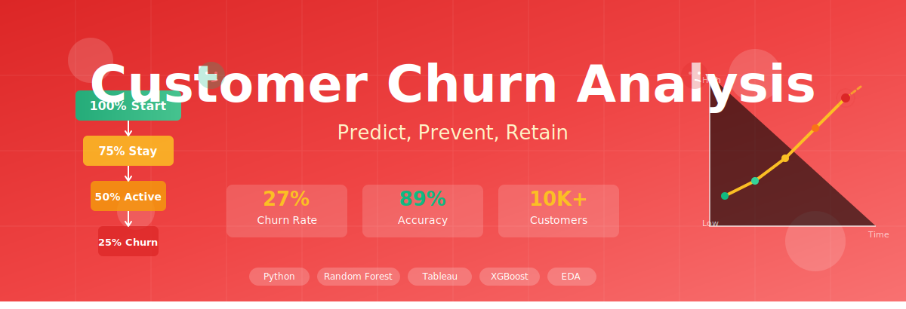

  

## 📊 Business Context

A subscription-based SaaS company is experiencing customer churn and wants to improve retention.

The goal of this project is to analyze customer behavior, identify churn drivers, and build a predictive model to detect at-risk users.

Understanding churn patterns can help the company:
- Reduce customer loss
- Increase lifetime value (LTV)
- Optimize retention strategies

- ## 🎯 Business Questions

1. Which customers are most likely to churn?
2. What factors (usage, pricing, engagement) drive churn?
3. Are high-value customers at risk of leaving?
4. Can we predict churn probability using customer data?
